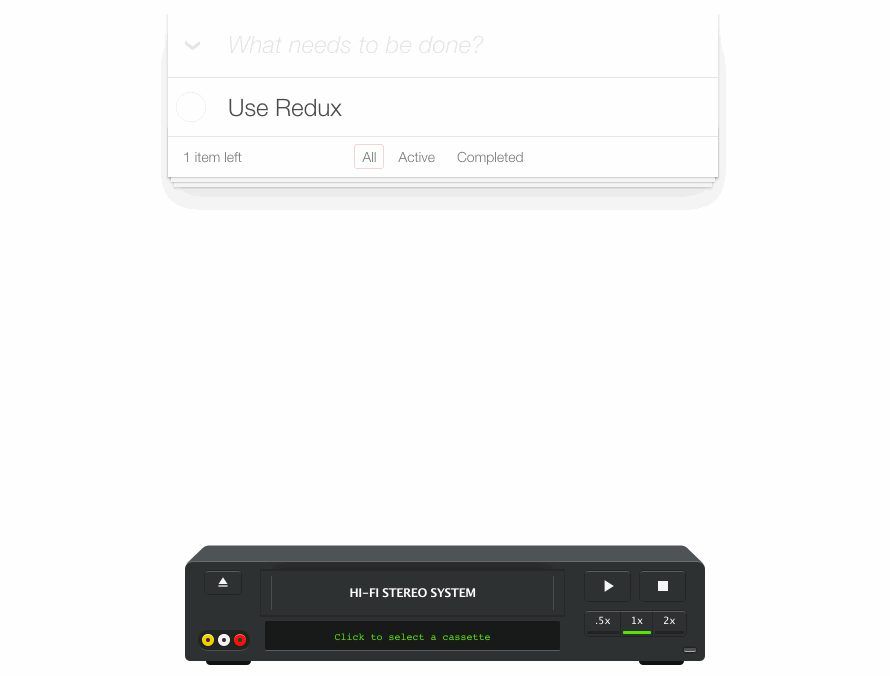

# ReduxVCR
### A Redux devtool that lets you replay user sessions in real-time.

_NOTE: This project is in **early alpha**. I've been using it in production in [Key&Pad](https://github.com/joshwcomeau/key-and-pad), but it has not been tested in larger/more complex applications._

-----------

## Demo

You can see a live demo of real, in-production data at **[Key&Pad](http://keyandpad.com?adminMode=true)**. Click on the VCR screen, select a cassette, and hear some dynamically-recreated music!

## Blog Post

Check out the [Medium post](https://medium.com/@joshuawcomeau/introducing-redux-vcr-cad57b37540a) that details how and why this is being built.

## Features

#### Insights

By re-watching a recorded session in real-time, you learn tons about how users use your application. Great for gauging UX, spotting bugs, etc.

#### Developer Experience

Features quality-of-life configuration:
- Max delay between actions: Set a maximum wait time, to remove long gaps when users go idle.
- Speed controls: play your cassettes in 0.5x or 2x speed.
- More to come!

#### Serverless Security

The goal for ReduxVCR was to not need any server-side integration for developers creating front-end-only applications, while still being secure. Using Firebase, we're able to automatically authenticate all users, assuring that they can only edit their own slice of the state, and not read from or write to any other users' sessions.

For replaying the sessions, GitHub OAuth is used. You set which GitHub email you want to have read access within Firebase.

#### Modular Architecture

Rather than create one monolithic package, ReduxVCR consists of 4 individual packages:

- **Capture**
  The capture layer is responsible for watching the stream of actions, selecting the ones that you'd like to record, and augmenting them with timestamps and metadata.

- **Persist**
  The persist layer receives the data from Capture and persists it to Firebase. It handles all anonymous authentication concerns.

- **Retrieve**
  The retrieve layer, meant to be used in development only, fetches the data from Firebase, and handles all admin authentication concerns.

- **Replay**
  Finally, the replay layer is your interface to navigating and watching the recorded cassettes.

An effort has been made to ensure that packages can be swapped out. For example, you may wish to use custom database storage, in which case you'd build your own Persist and Retrieve modules. You may wish to have a different UX, in which case you'd build your own Replay module.

#### Straightforward Integration

A fair amount of work has been put into making the integration as simple as possible. For simple apps, the process shouldn't take more than a couple of minutes.

--------

## Getting Started

There are two parts to integrating Redux VCR into your application.

* First, we need to set up Firebase to store our data, and ensure that your users' sessions are secured. **[Read the instructions for Firebase configuration.](documentation/firebase-config.md)**

* Second, we need to add the code needed to hook into Firebase and display the UI. **[Read the instructions for Javascript implementation.](documentation/javascript-implementation.md)**

## Troubleshooting

As common issues arise, their solutions will be shared here.

## Roadmap

There are a few pretty blatant things missing from ReduxVCR.

- Event Recording

  Right now, we're _only_ recording the series of Redux actions. Ideally, we'd want our scroll position to mirror the user's, and it would be nice to know where their cursor is.

- Scrubbing and Navigation

  When replaying cassettes, there is currently no way to "jump" to a specific portion in the cassette, to see how far along you are in the sequence, etc. A media-player-style scrubber would help quickly analyze and replay crucial moments in a cassette.

- Support for common tools and environments

  Immutable.js and React Native are both currently untested/unsupported.

I have limited free time at the moment, so if anybody would like to contribute to this project, these would be great places to start :)
