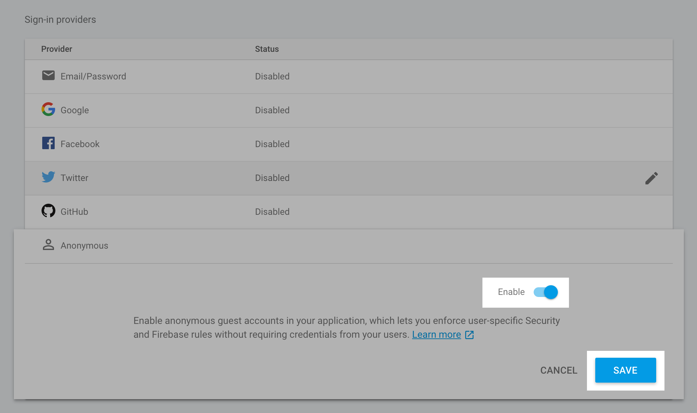
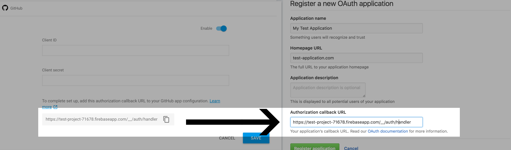
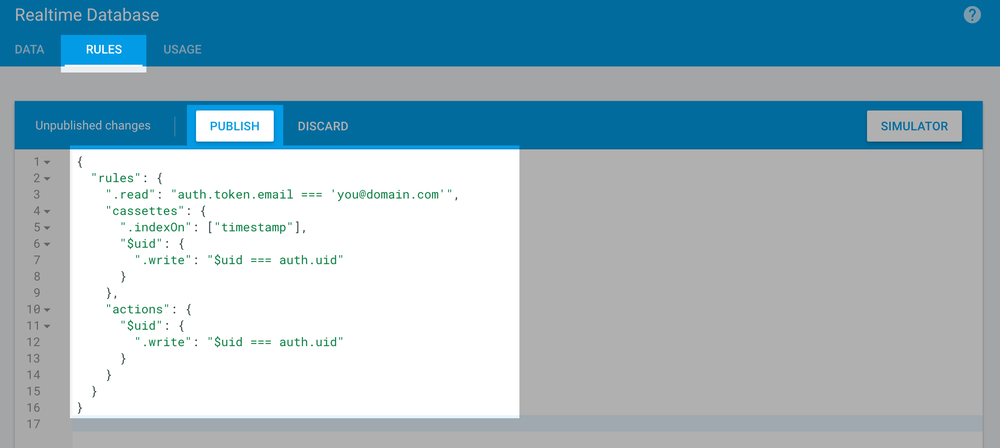
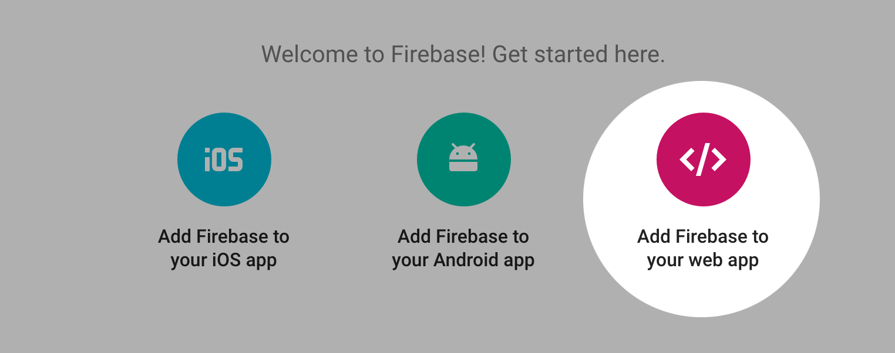
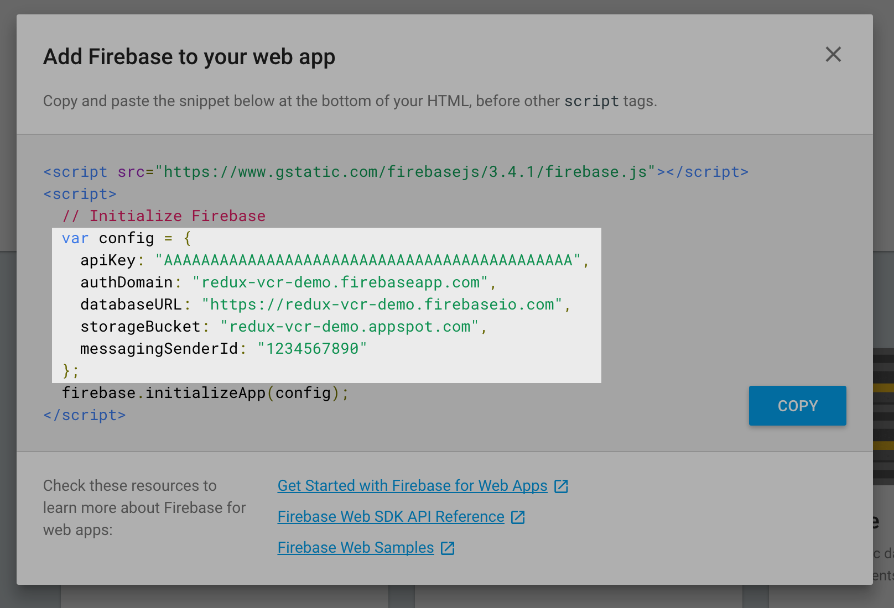

# Firebase Configuration

By default, ReduxVCR uses Firebase v3.2 for data persistence.


### Step 1: Sign up for Firebase and create a project

Head on over to firebase.google.com and sign up for a free account. Once you make it to [the console](https://console.firebase.google.com/), click 'CREATE NEW PROJECT'.

Select a name and region, and click 'CREATE PROJECT'.


### Step 2: Set up Authentication

This devtool needs to support two different "types" of users:

- We want anonymous, "background" authentication for the users of our sites. We want to record their sessions regardless of whether they're logged in or not.

- We want proper, third-party authentication for us developers, so that only privileged users can view the sessions we've recorded.


#### 2A - Anonymous authentication

Firebase supports anonymous authentication.

The idea is pretty simple: You make a request, on page load, to authenticate anonymously. The server generates a temporary ID, and the client can then use that ID to make authenticated requests. The ID is lost when the session ends, or the page is refreshed, which makes it perfect for our needs.

We need to enable anonymous authentication. In the left-hand menu, select 'Auth'. Then, from the header, select 'SIGN-IN METHOD'.

Click on 'Anonymous', the final option in the list of providers, and enable it.




#### 2B - Developer authentication

Next, we need to set up Github OAuth so that we can authenticate ourselves.

If you aren't already there, navigate to the 'SIGN-IN METHOD' page under 'Auth', and click on 'GitHub'. Click the 'Enable' toggle.

In a new tab, [head on over to GitHub and create a new application](https://github.com/settings/applications/new). Give your application a name, and paste in the "authorization callback URL" from Firebase. Click 'Register Application'.

GitHub will now have client keys for you. Copy and paste the ID and secret from GitHub into Firebase, and save your authorization details in Firebase.




### Step 3: Configure the rules for the project

We've now authenticated all users who connect to Firebase, but we need to set up authorization.

Firebase works with a JSON-like set of rules for controlling access, as well as other config like setting up indexes, or validating write requests.

For our anonymous users, we want them to be able to _write_ to their own slice of the database, but we don't want them to be able to _read_ from the database at all.

For our developers, we want them to have full _read_ access, but they don't need to be able to _write_.

#### Setup

In the left-hand menu, click 'Database', and then select 'RULES' from the main header.

Here are the rules you'll want to implement:

```js
{
  "rules": {
    ".read": "auth.token.email === 'your@domain.com'",
    "cassettes": {
      ".indexOn": ["timestamp"],
      "$uid": {
        ".write": "$uid === auth.uid"
      }
    },
    "actions": {
      "$uid": {
        ".write": "$uid === auth.uid"
      }
    }
  }
}
```

Firebase rules allow you to use logical operators like `&&` and `||`. For example, if you need multiple developers to be able to use the devtool, you could write:

```js
{
  "rules": {
    ".read": "auth.token.email === 'your@email.com' || auth.token.email === 'other@email.com'",
  }
}
```

You also have access to regular expressions, so you could structure it like:

```js
{
  "rules": {
    ".read": "auth.token.email.matches(/.*@your_company.com$/)",
  }
}
```

Once you're satisfied, click 'PUBLISH' to save the rules.




### Step 4: Get credentials

Finally, we need to get a copy of the credentials, so that our web app can connect to Firebase. Click on the name of your project in the top-left to go back to the root page, and then click 'Add Firebase to your web app'.



Copy just the `config` object:



------

That's it! You'll use the `config` object in your clipboard in the next section, [Javascript Implementation](javascript-implementation.md).
